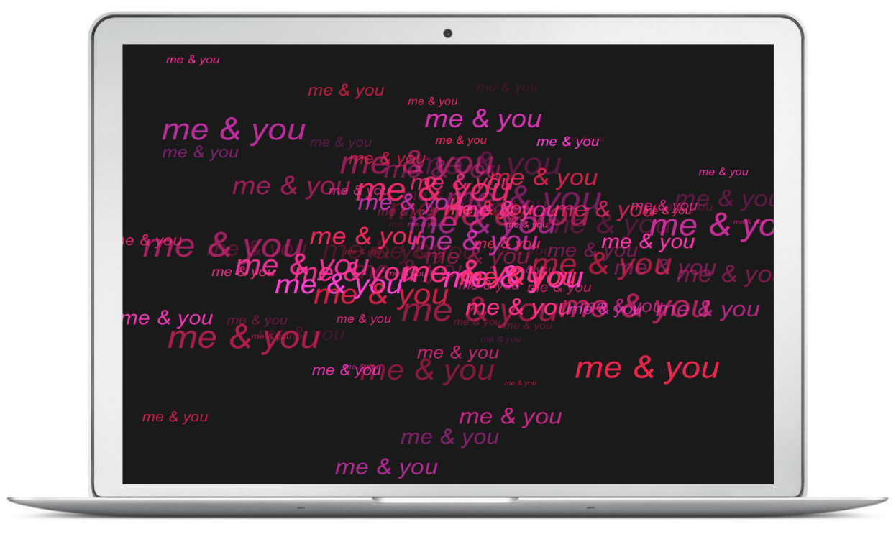

# Basic Manipulation Examples


## Introduction

This chapter provides more elaborated examples than the simple demos presented
so far. The idea is to show you less abstract scenarios and cases where you
could apply the functions and concepts covered so far.


### Example: Names of files

Imagine that you need to generate the names of 10 data `.csv` files. All the 
files have the same prefix name but each of them has a different number: 
`file1.csv`, `file2.csv`, ... , `file10.csv`. 

There are several ways in which you could generate a character vector with 
these names. One naive option is to manually type those names and form a
vector with `c()`

```{r}
c('file1.csv', 'file2.csv', 'file3.csv')
```

But that's not very efficient. Just think about the time it would take you
to create a vector with 100 files. A better alternative is to use the
vectorized nature of `paste()`

```{r}
paste('file', 1:10, '.csv', sep = "")
```

Or similarly with `paste0()`

```{r}
paste0('file', 1:10, '.csv')
```


### Example: Valid Color Names

R comes with the function `colors()` that returns a vector with the names 
(in English) of 657 colors available in R. How would you write a function 
`is_color()` to test if a given name---in English---is a valid R color. 
If the provided name is a valid R color, `is_color()` should return `TRUE`. 
If the provided name is not a valid R color `is_color()` should return `FALSE`.

```{r}
is_color <- function(x) {
  x %in% colors()
}
```

Lets test it:

```{r}
is_color('yellow')  # TRUE

is_color('blu')     # FALSE

is_color('turkuiose') # FALSE
```

Another possible way to write `is_color()` is comparing if `any()` element
of `colors()` equals the provided name:

```{r}
is_color2 <- function(x) {
  any(colors() == x)
}
```

Test it:

```{r}
is_color2('yellow')  # TRUE

is_color2('blu')     # FALSE

is_color2('turkuiose') # FALSE
```


### Example: Me and You plot

This example is not really about data analysis or something serious, it is 
instead a fun project in which you get to apply what we have covered so far.
The idea is to produce a plot with some text on it. But not any kind of text.
The plot is intended to be a postcard---for Saint Valentine's day.
With this kind of tutorial, you should be able to make youw own plot, print it 
and give it to your significant other.

The idea is to make a chart with your name and the name of your significant 
other, adding a touch of randomness in the location of the text, the sizes, and
the colors.

First we generate the x-y coordinates. We'll use 100 points, and set the 
random seed to 333:

```{r me-and-you-coords}
# random seed
set.seed(333)

# x-y coordinates
n <- 100
x <- rnorm(n)
y <- rnorm(n, 1, 2)
```


The first step is to produce a very basic-raw plot (nothing fancy). We use 
`plot()` for this purpose:

```{r me-and-you0, eval = FALSE}
plot(x, y)
```

This just produces a scatter diagram with a 100 points on it. The following 
step consists of replacing the dots by some text: your name and the one of your 
significant other. To hide the dots, we set the parameter `type = "n"`, which 
means that we don't want anything to be plotted. To show the text, we use the 
low level plotting function `text()`. We use the same coordinates, but this 
time we specify the displayed `labels`:

```{r me-and-you1, eval = FALSE}
plot(x, y, type = "n")
text(x, y, labels = "me & you")
```

Again, this is a very preliminary plot; something basic that allows us to
start getting a feeling of how the chart looks like. The second step is to 
change the background color. One way to do this is by specifying the `bg` 
graphical parameter inside the `par()` function:

```{r me-and-you2}
# graphical parameters
op <- par(bg = "gray10")
# plot text
plot(x, y, type = "n")
text(x, y, 
     labels = "me & you",
     col = "white")
# reset default parameters
par(op)
```

`par()` has default settings. Everytime you call `par()` and change 
one of the associated parameters, the subsequent plots will be displayed with
those values. To set parameters in a temporary way, you can assign them to 
an object: i.e. `op`. After the plot is produced, we reset the default 
graphical parameters with the instruction `par(op)`.

We are getting closer to the desired look of the postcard. The final stage is 
to add some color to the text, and change their size. The size of the labels 
will also be random with a uniform distribution.

R provides several ways to specify colors. In this example we will use the
`hsv()` function (i.e. hue-saturation-value). This function requires three
parameters: hue (color), saturation, and value. Hues are specified with a range
from 0 to 1. We generate some random numbers in the interval 0.85 - 0.95 to get
some hues red, pink, fuchsia colors. `hsv()` also takes the optional 
parameters `alpha` to determined the alpha transparency.

```{r}
# text size
sizes <- runif(n, 0.5, 3)

# text color
hues <- runif(n, 0.85, 0.95)
alphas <- runif(n, 0.1, 1)


op <- par(bg = "gray10", mar = rep(0, 4))
plot(x, y, type = "n", axes = FALSE, 
     xlab = '', ylab = '')
text(x, y, 
     labels = "me & you", 
     font = 3, 
     col = hsv(hues, 1, 1, alphas),
     cex = sizes)
par(op)
```

To save the image, call `pdf()`. To give the image the dimensions of a 
standard postcard, you can specify `width = 5` and `height = 3.5`, that is,
5 inches wide and 3.5 inches tall (you can choose other dimensions if you want):

```{r me-and-you3-pdf, eval = FALSE}
pdf(file = "figure/me-and-you3.pdf", width = 5, height = 3.5)
op <- par(bg = "gray10", 
          mar = rep(0, 4))
plot(x, y, type = "n", axes = FALSE, 
     xlab = '', ylab = '')
text(x, y, 
     labels = "me & you", 
     font = 3, 
     col = hsv(hues, 1, 1, alphas),
     cex = sizes)
par(op)
dev.off()
```

If you save the image in png format, you could also use it as a wallpaper for your
computer:


