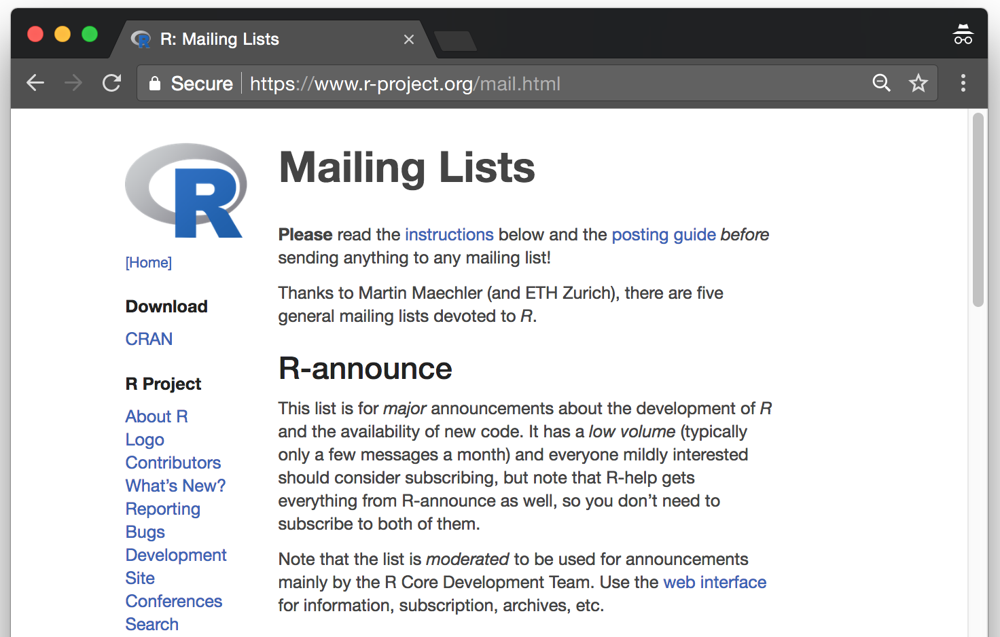
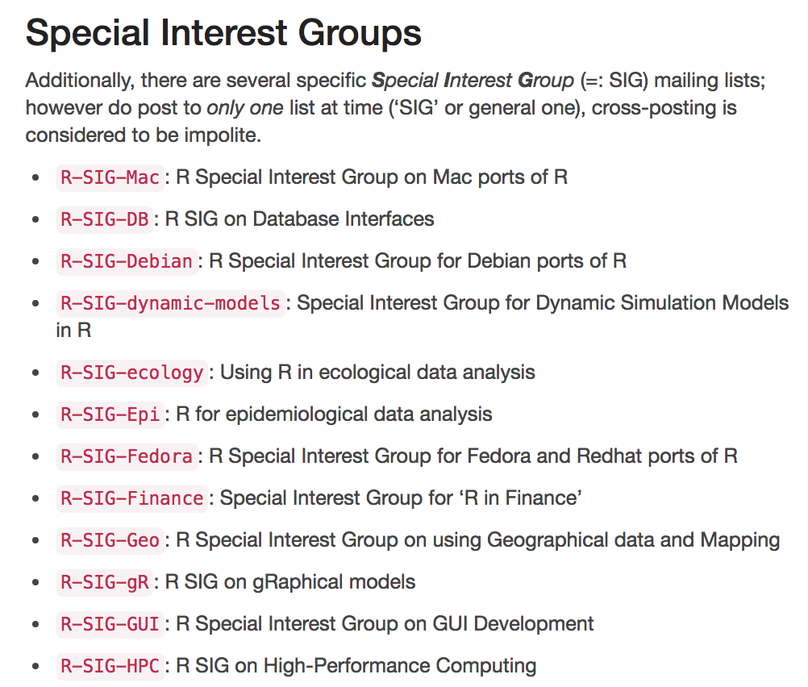

# Matching HTML Tags {#html}

## Introduction

In this example we will deal with some basic handling of HTML tags. The data for this practical application is the webpage for the R mailing lists: [http://www.r-project.org/mail.html](http://www.r-project.org/mail.html) (see screenshot below)

```{r echo = FALSE, out.width = NULL}

```

If you visit the previous webpage you will see that there are five general mailing lists devoted to R:

- __R-announce__ is where major announcements about the development of R and the availability of new code.
- __R-help__ is the main R mailing list for discussion about problems and solutions using R.
- __R-package-devel__ is to get help about package development in R
- __R-devel__ is a list intended for questions and discussion about code development in R.
- __R-packages__ is a list of announcements on the availability of new or enhanced contributed packages.


Additionally, there are several specific \textbf{Special Interest Group} (SIG) mailing lists. Here's a screenshot with some of the special groups:  

```{r echo = FALSE, out.width = NULL}

```


## Attributes `href`

As a simple example, suppose we wanted to get the `href` attributes of all the SIG links. For instance, the `href` attribute of the R-SIG-Mac link is: `https://stat.ethz.ch/mailman/listinfo/r-sig-mac`

In turn the `href` attribute of the R-sig-DB link is: `https://stat.ethz.ch/mailman/listinfo/r-sig-db`

If we take a peek at the html source-code of the webpage, we'll see that all the links can be found on lines like this one:

```
"<li><p><a href=\"https://stat.ethz.ch/mailman/listinfo/r-sig-mac\"><code>R-SIG-Mac</code></a>: R Special Interest Group on Mac ports of R</p></li>"
```

\begin{verbatim}
    <td><a href="https://stat.ethz.ch/mailman/listinfo/r-sig-mac">
<tt>R-SIG-Mac</tt></a></td>
\end{verbatim}


### Getting SIG links

The first step is to create a vector of character strings that will contain the lines of the mailing lists webpage. We can create this vector by simply passing the URL name to `readLines()`:

```{r read_mail_list, echo=FALSE}
# read html content
mail_lists = readLines("data/mail.html")
```

```{r read_mails, eval=FALSE}
# read html content
mail_lists = readLines("http://www.r-project.org/mail.html")
```

The first elements in `mail_lists` are:

```{r}
head(mail_lists)
```

Once we've read the HTML content of the R mailing lists webpage, the next step is to define our regex pattern that matches the SIG links. 

```
'^.*<p><a href="(https.*)">.*$'
```

Let's examine the proposed pattern. By using the caret `^` and dollar sign `$` we can describe our pattern as an entire line. Next to the caret we match anything zero or more times followed by a `<td>` tag. Then there is a blank space matched zero or more times, followed by an anchor tag with its `href` attribute. Note that we are using double quotation marks to match the `href` attribute (`"(https.*)"`). Moreover, the entire regex pattern is surrounded by single quotations marks `' '`. Here is how we can get the SIG links:

```{r mail_list}
# SIG's href pattern
sig_pattern = '^.*<p><a href="(https.*)">.*$'

# find SIG href attributes
sig_hrefs = grep(sig_pattern, mail_lists, value = TRUE)

# let's see first 5 elements
head(sig_hrefs, n = 5)
```

We need to get rid of the extra html tags. We can easily extract the names of the note files using the `sub()` function (since there is only one link per line, we don't need to use `gsub()`, although we could).

```{r extract_hrefs}
# get first matched group
sigs = sub(sig_pattern, '\\1', sig_hrefs)
sigs
```

As you can see, we are using the regex pattern `\\1` in the `sub()` function. Generally speaking `\\N` is replaced with the `N`-th group specified in the regular expression. The first matched group is referenced by `\\1`. In our example, the first group is everything that is contained in the curved brackets, that is: `(https.*)`, which are in fact the links we are looking for.

